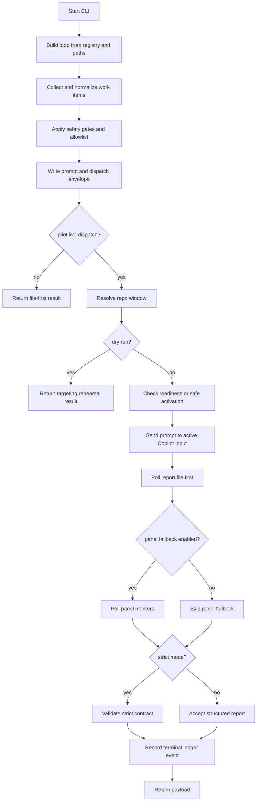

# Orchestration V1 Operator Runbook

## Purpose

Use this runbook to operate `scripts/orchestration_v1.py` safely.

The command surface now supports several distinct operator workflows:

- Read-only preflight
- Readiness-only targeting checks
- Live pilot dry-run rehearsal
- Live pilot dispatch
- Strict first-reply validation
- Explicit fallback targeting
- Sandbox self-test

The safe order is:

1. Run preflight.
2. Run readiness-only for the exact target window.
3. Rehearse with live dry-run if you are using a new target path.
4. Run live pilot only after readiness says `ready_to_send`.

## Safety Model

- `state/orchestration/` is runtime scratch space.
- Do not commit dispatch queue files, worker reports, or the live ledger.
- `--pilot-live-dispatch` is opt-in. Without it, the command stays file-first and never sends text to VS Code.
- `--pilot-readiness-only` never sends text.
- `--pilot-dry-run` validates selection without sending text.
- Strict mode is intentionally narrow. If strict mode is enabled, operators should expect hard rejection for malformed framing, JSON, or schema.

## Defaults That Matter

These are the actual defaults in the current CLI:

| Flag                                 | Default | Operator impact                                                                                                                               |
| ------------------------------------ | ------- | --------------------------------------------------------------------------------------------------------------------------------------------- |
| `--poll-seconds`                     | `0`     | The baseline `--json` run dispatches a file-first work item, then stops immediately if no report already exists. It does not wait by default. |
| `--poll-interval`                    | `5`     | Baseline and pilot polling interval.                                                                                                          |
| `--pilot-poll-seconds`               | `180`   | Live pilot waits up to 180 seconds for a response unless overridden.                                                                          |
| `--pilot-preflight-timeout`          | `0.5`   | Preflight window discovery timeout.                                                                                                           |
| `--pilot-fallback-open-wait-seconds` | `2.0`   | Delay before re-running preflight after fallback open.                                                                                        |

Behavioral defaults:

- Preflight checks all managed repos unless `--pilot-preflight-repo` is supplied.
- Readiness-only always uses safe activation behavior, even if `--pilot-safe-activate` is omitted.
- Live pilot defers the loop's normal file poll and uses pilot polling instead.
- Panel fallback is enabled for live pilot polling unless `--pilot-no-panel-fallback` is set.
- `--pilot-known-good-strict` forces strict mode and disables panel fallback.

## Exit Codes

Do not treat process exit alone as the full result once the command enters the main orchestration path.

Guard branches use non-zero exit codes:

| Exit | Meaning                                                                     |
| ---- | --------------------------------------------------------------------------- |
| `0`  | Success, or a soft-failure that is described inside the JSON payload        |
| `2`  | Readiness blocked, or preflight found windows but not enough eligible repos |
| `3`  | Preflight found zero VS Code windows                                        |
| `4`  | Preflight repo filter does not exist in the registry                        |
| `5`  | Explicit fallback requested without `--pilot-live-dispatch`                 |
| `6`  | Explicit fallback missing repo or workspace path                            |
| `7`  | Sandbox self-test requested without `--pilot-live-dispatch`                 |
| `8`  | Sandbox self-test missing `--pilot-window-id`                               |
| `9`  | Readiness-only missing `--pilot-readiness-repo`                             |
| `10` | Readiness-only missing `--pilot-window-id`                                  |
| `11` | Readiness-only repo not found in the registry                               |

Once the run enters the main live path, inspect these JSON fields instead of relying on exit code:

- `decision`
- `decision_reason`
- `report_status`
- `pilot.status`
- `strict_response.verdict`
- `strict_response.reason_code`

## Mode Map

| Scenario                  | Required flags                                                                                                                   | Optional flags                                                        | Primary success signal                               |
| ------------------------- | -------------------------------------------------------------------------------------------------------------------------------- | --------------------------------------------------------------------- | ---------------------------------------------------- |
| Baseline file-first cycle | none                                                                                                                             | `--poll-seconds`, `--ledger`, `--dispatch-root`, `--report-root`      | `decision` and dispatch artifacts                    |
| Preflight                 | `--pilot-preflight`                                                                                                              | `--pilot-preflight-repo`, `--pilot-window-id`, `--pilot-window-index` | `summary.repos_eligible` and `selection.reason_code` |
| Readiness-only            | `--pilot-readiness-only --pilot-readiness-repo <repo> --pilot-window-id <id>`                                                    | `--json`                                                              | `ready_to_send=true`                                 |
| Live dry-run              | `--pilot-live-dispatch --pilot-dry-run`                                                                                          | `--pilot-window-id`, `--pilot-safe-activate`                          | `pilot.status=dry_run`                               |
| Live pilot                | `--pilot-live-dispatch`                                                                                                          | `--pilot-window-id`, `--pilot-safe-activate`, `--pilot-poll-seconds`  | `pilot.status=completed` or accepted response fields |
| Strict live pilot         | `--pilot-live-dispatch --pilot-strict-response`                                                                                  | `--pilot-window-id`, `--pilot-safe-activate`                          | `strict_response.verdict`                            |
| Known-good strict         | `--pilot-live-dispatch --pilot-known-good-strict`                                                                                | `--pilot-window-id`, `--strict-plain-text`                            | `strict_response.verdict` with file-only polling     |
| Explicit fallback         | `--pilot-live-dispatch --pilot-fallback-explicit-target --pilot-fallback-repo <repo> --pilot-fallback-workspace-path <abs path>` | `--pilot-fallback-open-if-missing`, `--pilot-window-id`               | `fallback_targeting.dispatch_allowed=true`           |
| Sandbox self-test         | `--pilot-live-dispatch --pilot-sandbox-self-test --pilot-window-id <id>`                                                         | `--pilot-dry-run`, `--report-root`, `--strict-plain-text`             | sandbox strict acceptance                            |

## Quickstart

### 1. Safe File-First Baseline

This is a copy-paste-safe command that keeps runtime artifacts out of the tracked scratch paths.

```powershell
$scratch = Join-Path $env:TEMP "orchestration-v1-safe"

python scripts/orchestration_v1.py `
  --ledger (Join-Path $scratch "global_ledger.jsonl") `
  --dispatch-root (Join-Path $scratch "dispatch_queue") `
  --report-root (Join-Path $scratch "worker_reports") `
  --poll-seconds 0 `
  --json
```

Expected result:

- `run_id` is present when a work item was selected.
- A prompt and dispatch envelope are written under the temp dispatch root.
- With `--poll-seconds 0`, expect a stop-like outcome unless a report already exists.
- Typical baseline terminal fields are `decision="stop"` and `decision_reason="No structured worker report available before poll timeout"`.

### 2. Preflight Before Any Send

Use preflight to answer: can v1 see the right repo window, and is it eligible for dispatch?

```powershell
python scripts/orchestration_v1.py `
  --pilot-preflight `
  --pilot-preflight-repo trading `
  --pilot-preflight-timeout 0.2 `
  --json
```

Verified output shape on this machine:

- `mode="pilot_preflight"`
- `summary.windows_total=11`
- `summary.repos_eligible=0`
- `repo_diagnostics[0].selection.reason_code="repo_window_detected_win32_only"`

Interpretation:

- `selected_single_match` or `selected_best_ranked_match`: proceed to readiness-only.
- `repo_window_detected_win32_only`: the repo window exists but is off-desktop or cloaked from the UIA snapshot. Move it onto the active desktop or use explicit fallback.
- `ambiguous_repo_window`: stop and use an explicit `--pilot-window-id` from preflight.
- `no_matching_repo_window`: do not attempt live dispatch.

### 3. Readiness-Only for the Exact Window

Replace `<repo_id>` and `<window_id>` with the values from preflight.

```powershell
python scripts/orchestration_v1.py `
  --pilot-readiness-only `
  --pilot-readiness-repo <repo_id> `
  --pilot-window-id <window_id> `
  --json
```

Expected result:

- `mode="pilot_readiness_only"`
- `selected_window_id` echoes the requested target when it is selectable
- `ready_to_send=true` is the only green state
- `next_step="run_live_dispatch"` when ready
- If blocked, `dispatch_readiness.reason_code` and `operator_guidance.recommended_actions` tell you what to fix

Do not run live dispatch until readiness reports `ready_to_send`.

### 4. Live Dry-Run Rehearsal

Use repo-targeted dry-run to validate selection without sending text or invoking scheduler-backed dispatch semantics.

```powershell
python scripts/orchestration_v1.py `
  --pilot-live-dispatch `
  --pilot-dry-run `
  --pilot-dry-run-repo <repo_id> `
  --pilot-window-id <window_id> `
  --json
```

Expected result:

- `mode="pilot_repo_targeted_dry_run"`
- `scope="targeting_only"`
- `targetable=true` confirms the repo/window targeting path
- `selected_window_id` and `window_match_diagnostics` confirm the target

This command does not exercise scheduler selection, allowlist checks, concurrency gates, prompt generation, or ledger dispatch.

### 5. Live Pilot

After readiness succeeds, run live pilot against the same window id.

```powershell
python scripts/orchestration_v1.py `
  --pilot-live-dispatch `
  --pilot-safe-activate `
  --pilot-window-id <window_id> `
  --json
```

Expected result:

- `pilot.status="completed"`, `"timeout"`, or `"failed"`
- `decision` reflects the orchestrator decision for the captured response
- `report_status` is populated when a structured response was accepted

### 6. Strict First-Reply Mode

Use this when the first accepted structured reply matters more than doing work immediately.

```powershell
python scripts/orchestration_v1.py `
  --pilot-live-dispatch `
  --pilot-known-good-strict `
  --pilot-window-id <window_id> `
  --strict-plain-text
```

Expected result:

- strict parsing is enabled
- panel fallback is disabled
- plain text includes a single `strict_response ...` line summarizing verdict and next step

## Run Lifecycle



## Practical Scenarios

### Scenario A: Operator Preflight

Use when:

- you need to see whether the managed repo windows are discoverable
- you suspect the repo window is on another desktop
- you want the exact `window_id` before any readiness or live send

Key fields:

- `summary.windows_total`
- `summary.repos_eligible`
- `repo_diagnostics[].selection.reason_code`
- `repo_diagnostics[].selection.selected_window_id`
- `window_enumeration_diagnostics.summary.windows_omitted_from_uia`

### Scenario B: Readiness-Only Safety Check

Use when:

- preflight already identified the exact window id
- you want to confirm foreground focus and chat input readiness

Green state:

- `dispatch_readiness.reason_code="ready_to_send"`

Blocked states to expect:

- `target_not_foreground`
- `chat_panel_not_detected`
- `chat_input_not_detected`
- `readiness_probe_error`
- `operator_window_id_not_found`

### Scenario C: Live Pilot With Safe Activation

Use when:

- readiness already passed
- you want the send path to fail closed if the target is not really foreground and sendable

Recommended flags:

- `--pilot-live-dispatch`
- `--pilot-safe-activate`
- `--pilot-window-id <window_id>`

### Scenario D: Explicit Fallback

Use when preflight says:

- `no_matching_repo_window`
- `repo_window_detected_win32_only`

Do not use fallback to solve `ambiguous_repo_window`. That requires an explicit window id.

### Scenario E: Strict Operation

Use when:

- you need marker-framed JSON acceptance
- you want a deterministic first reply
- you are debugging strict parser rejections

Operator fields to watch:

- `strict_response.verdict`
- `strict_response.reason_code`
- `strict_response.primary_reject_reason`
- `strict_response.primary_hint_text`
- `strict_response.operator_next_step`

### Scenario F: Sandbox Self-Test

Use only for a strict round-trip safety check against `desktop-agent-automation`.

Hard rules:

- requires `--pilot-live-dispatch`
- requires `--pilot-window-id`
- accepts triage-only strict payloads
- accepts report-file replies only

## Failure Cookbook

### Invocation Guards

| Error                                       | Meaning                                           | Corrective action                                                         |
| ------------------------------------------- | ------------------------------------------------- | ------------------------------------------------------------------------- |
| `fallback_requires_live_dispatch`           | Fallback was requested without live pilot         | Add `--pilot-live-dispatch`                                               |
| `fallback_requires_repo_and_workspace_path` | Fallback is missing one of its required selectors | Supply both `--pilot-fallback-repo` and `--pilot-fallback-workspace-path` |
| `readiness_requires_repo`                   | Readiness-only repo id missing                    | Add `--pilot-readiness-repo <repo>`                                       |
| `readiness_requires_window_id`              | Readiness-only window id missing                  | Run preflight first, then pass `--pilot-window-id <id>`                   |
| `repo_not_found`                            | Requested repo is not in the managed registry     | Use a repo id from `automation/managed_workspace_registry.json`           |
| `sandbox_requires_live_dispatch`            | Sandbox self-test is a live pilot feature         | Add `--pilot-live-dispatch`                                               |
| `sandbox_requires_window_id`                | Sandbox self-test needs an explicit target window | Run preflight and pass `--pilot-window-id <id>`                           |

### Preflight And Targeting

| Reason code                       | Meaning                                                   | Corrective action                                                         |
| --------------------------------- | --------------------------------------------------------- | ------------------------------------------------------------------------- |
| `no_matching_repo_window`         | No eligible repo window was found                         | Open or restore the repo window, then rerun preflight                     |
| `ambiguous_repo_window`           | More than one repo window is eligible                     | Capture the exact `selected_window_id` and rerun with `--pilot-window-id` |
| `repo_window_detected_win32_only` | Repo window exists but is off-desktop or cloaked to UIA   | Move it onto the active desktop or use explicit fallback open             |
| `operator_window_id_not_found`    | Requested window id is stale or not a match for that repo | Rerun preflight and use a fresh id                                        |
| `operator_index_out_of_range`     | Requested ranked match index is stale or invalid          | Rerun preflight and choose a valid index                                  |
| `operator_selector_conflict`      | Window id and window index point to different targets     | Use one selector or make them agree                                       |
| `selected_window_missing`         | Target disappeared between selection and dispatch         | Rerun preflight                                                           |

### Readiness And Activation

| Reason code               | Meaning                                       | Corrective action                                            |
| ------------------------- | --------------------------------------------- | ------------------------------------------------------------ |
| `ready_to_send`           | Target is foreground and sendable             | Proceed to live pilot                                        |
| `target_not_foreground`   | Wrong foreground window after focus probe     | Bring the exact window forward, click input, rerun readiness |
| `chat_panel_not_detected` | Chat UI is not visible in that window         | Make Copilot chat visible, then rerun readiness              |
| `chat_input_not_detected` | Chat input is not ready                       | Click inside the input and rerun readiness                   |
| `readiness_probe_error`   | Readiness inspection failed                   | Treat as blocked, rerun preflight then readiness             |
| `window_focus_failed`     | Focus step could not bring the target forward | Fix the window state before retrying                         |

### Dispatch And Polling

| Reason or field                | Meaning                                                        | Corrective action                                                           |
| ------------------------------ | -------------------------------------------------------------- | --------------------------------------------------------------------------- |
| `dispatch_prompt_missing`      | Prompt file was expected but not present in the dispatch queue | Inspect file-first dispatch generation before retrying pilot                |
| `fallback_repo_mismatch`       | Selected work item repo does not match fallback repo argument  | Fix operator inputs                                                         |
| `pilot_fallback_rejected`      | Fallback preflight did not authorize dispatch                  | Follow the fallback reason and return to preflight                          |
| `pilot_dispatch_failed`        | Target resolution or send path failed                          | Inspect `pilot.window_match_diagnostics` and `dispatch_readiness`           |
| `pilot_response_timeout`       | No structured response arrived before timeout                  | Confirm whether a report was actually written, then retry                   |
| `duplicate_completion_ignored` | Another terminal event already closed the run                  | Inspect the ledger before retrying                                          |
| `pilot_dry_run`                | Dry-run completed without sending prompt                       | Use it as a rehearsal success, then remove `--pilot-dry-run` for live pilot |

### Strict Response Summary Codes

| `strict_response.reason_code`     | Meaning                                          | Corrective action                                        |
| --------------------------------- | ------------------------------------------------ | -------------------------------------------------------- |
| `accepted`                        | Strict response accepted                         | Continue                                                 |
| `waiting_for_response`            | Live run is still in a pending state             | Keep polling or wait                                     |
| `response_timeout`                | Nothing acceptable arrived in time               | Confirm the response source and resend if needed         |
| `strict_contract_rejected`        | Markers, JSON, or schema were invalid            | Use the strict guide and resend clean marker-framed JSON |
| `sandbox_contract_rejected`       | Sandbox reply violated triage-only constraints   | Use the strict guide's sandbox section                   |
| `malformed_response`              | Non-strict structured parsing failed             | Inspect the raw response source                          |
| `conflicting_response_candidates` | Multiple different strict candidates were seen   | Deduplicate reports and retry                            |
| `ambiguous_repo_window`           | Panel fallback could not isolate one repo window | Rerun preflight and use `--pilot-window-id`              |

### Common Strict Primary Rejections

| Primary rejection                                   | Corrective action                                   |
| --------------------------------------------------- | --------------------------------------------------- |
| `E_MARKER_START_INVALID`                            | Return exactly one START marker                     |
| `E_MARKER_END_INVALID`                              | Return exactly one END marker                       |
| `E_OUTSIDE_MARKER_TEXT`                             | Remove headings, code fences, and trailing notes    |
| `E_PAYLOAD_NOT_JSON`                                | Send one valid JSON object only                     |
| `E_PAYLOAD_NOT_OBJECT`                              | Wrap the payload as one JSON object                 |
| `E_RUN_ID_MISMATCH` / `E_PAYLOAD_RUN_ID_MISMATCH`   | Copy the current `run_id` into markers and payload  |
| `E_REPO_ID_MISMATCH` / `E_PAYLOAD_REPO_ID_MISMATCH` | Copy the current `repo_id` into markers and payload |
| `E_PROTOCOL_UNSUPPORTED`                            | Set `protocol` to `pilot_response_v1`               |
| `E_STATUS_INVALID`                                  | Use `success`, `partial`, `blocked`, or `failed`    |
| `E_BODY_MISSING`                                    | Provide the required `body` object                  |
| `E_DUPLICATE_CANDIDATE`                             | Keep one authoritative report source                |
| `E_CONFLICTING_CANDIDATE`                           | Remove conflicting copies and retry                 |
| `E_AMBIGUOUS_REPO_WINDOW`                           | Use explicit window targeting                       |

For the complete strict rejection catalog, see `docs/ORCHESTRATION_V1_STRICT_RESPONSE_GUIDE.md`.

### Allowlist And Selection Gates

If preflight and readiness look fine but no live work is being selected, inspect selection diagnostics instead of the window state.

Relevant fields:

- `diagnostics.selection.rejected_counts`
- `diagnostics.selection.pilot_allowlist_reason_counts`
- `diagnostics.selection.blocked_term_counts`

Common reasons:

- `category_not_allowed`
- `severity_not_allowed`
- `source_not_allowed`
- `title_contains_blocked_term`
- `task_class_not_allowed`

These are task-selection problems, not UI-targeting problems.

## Related Docs

- `docs/ORCHESTRATION_V1_STRICT_RESPONSE_GUIDE.md`
- `docs/pilot_window_targeting_checklist.md`
- `docs/TROUBLESHOOTING.md`
